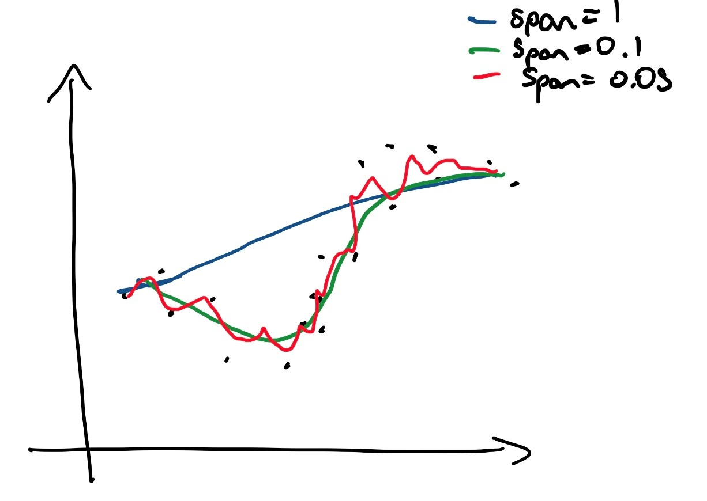
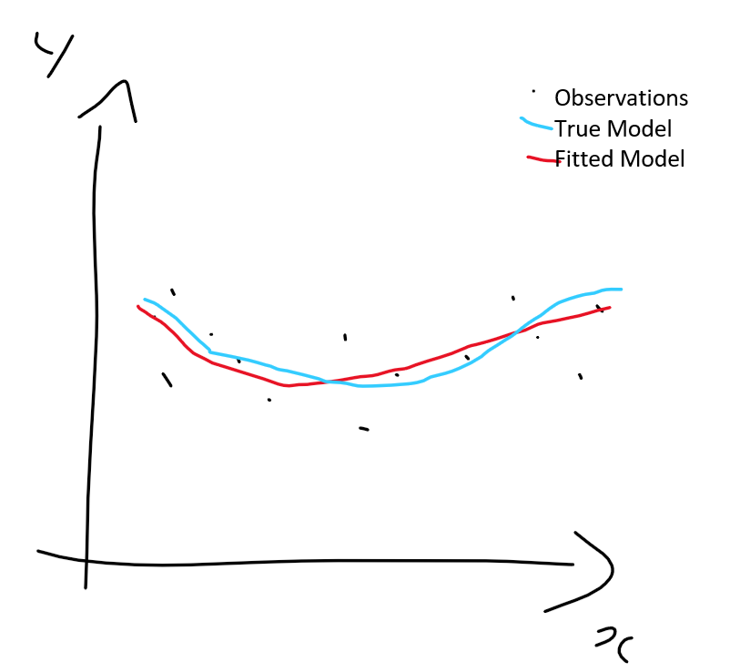

```{r setup, include=FALSE}
knitr::opts_chunk$set(
  message = FALSE,
  warning = FALSE,
  error = FALSE,
  collapse = TRUE,
  comment = "#",
  fig.height = 4,
  fig.width = 6,
  fig.align = "center",
  cache = FALSE
)

```

## Instructions

- You need to turn into moodle, the two files, your `Rmd` and `html` files.
- **List your team members as authors** on the report. For each of the four assignments, one team member needs to be nominated as the leader, and is responsible for coordinating the efforts of other team members, and submitting the assignment.
- The expected mode of working is that **you individually complete the assignment**, and then compare your answers and explanations with your team mates. Each student will have the opportunity to report on other team member's efforts on the assignment, and also report  on their own lack of contribution. If a member does not substantially contribute to the team submission they may get a reduced mark. If a team member fails to report their lack of contribution they will receive a zero mark.
- R code should be hidden in the final report, unless it is specifically requested.
- Original work is expected. Any material used from external sources needs to be acknowledged and cited appropriately.
- To make it a little easier for you, a skeleton of R code is provided in the `Rmd` file. Where you see `???` means that something is missing and you will need to fill it in with the appropriate function, argument or operator. You will also need to rearrange the code as necessary to do the calculations needed.

## Marks

- Total mark will be out or 25
- 5 points will be reserved for readability, and appropriate citing of external sources
- 5 points will be reserved for reproducibility, that the report can be re-generated from the submitted Rmarkdown.
- Accuracy and completeness of answers, and clarity of explanations will be the basis for the remaining 15 points.

##Team Members

26927462 Phadon Phipat
27103013 Kwan King Yung
29730163 Thomas Hughes


```{r, echo=FALSE}
# Load libraries
library(caret)
library(broom)
library(tidyverse)
```

## Exercises

1. This question explores bias-variance trade-off. Read in the simulated data `cuddly_koalas.rds`. This data is generated using the following function:

$$ y = -4x + 6x^2 - 100sin(x) + \varepsilon, ~~\text{where}~~x\in [-10, 20], ~~\varepsilon\sim N(0, 50^2)$$

a. (1)Make a plot of the data, overlaying the true model.

```{r, echo=FALSE}
# Read data
df <- readRDS("cuddly_koalas.rds")

# Compute the true model values
df <- df %>% mutate(true=-4*x+6*x^2-100*sin(x))

# Plot data and true model
ggplot(df, aes(x=x, y=y)) + geom_point() +
  geom_line(aes(x=x, y=true), colour="blue")
```

b. (1)Break the data into a $2/3$ training and a $1/3$ test set. (Hint: You can use the function `createDataPartition` from the `caret` package.) Fit a linear model, using the training set. Compute the training MSE and test MSE. Overlay the linear model fit on a plot of the data and true model.

```{r, echo=FALSE}
# Create training and test sets
set.seed(20200318)
tr_indx <- createDataPartition(df$y, p=2/3)$Resample1
tr <- df[tr_indx,]
ts <- df[-tr_indx,]

# Fit linear model
fit1 <- lm(y~x, data=tr)
tr_aug <- augment(fit1, tr)
ts_aug <- augment(fit1, newdata=ts)
tr_aug$.resid <- tr_aug$y - tr_aug$.fitted
ts_aug$.resid <- ts_aug$y - ts_aug$.fitted
tr_mse <- sum(tr_aug$.resid^2)/length(tr_aug)
ts_mse <- sum(ts_aug$.resid^2)/length(ts_aug)

# Plot the data, true model and fitted model
ggplot(df, aes(x=x, y=y)) + geom_point() +
  geom_line(aes(y=true)) + geom_point(data=ts_aug, aes(x=x, y=.fitted), colour="orange")
```

c. Now examine the behaviour of the training and test MSE, for a `loess` fit.
	i. (1)Look up the `loess` model fit, and write a paragraph explaining how this fitting procedure works. In particular, explain what the `span` argument does. Add a (hand) sketch illustrating the method.

>Loess also known as local regression is a nonparametric technique that uses local weighted regression to fit a smooth curve through points in a scatter plot. There are 4 main steps to the method.
1. Choose a span parameter that represents the proportion of points to use for local regression. The smaller the span, the less points make up a local neighborhood and the more local regressions will be performed.
2. Find the k nearest neighbours to x0 where k=floor(n*s) and x0 is where the loess model is fitted to.
3. Assign weights to nearest neighbours using the tri-cubic function. The weight function gives more weight to observations whose X value is close to x0 and less weight to observations that are farther away.
4. Perform local weighted regression. We use the points in the local neighbourhood of x0 to fit a local weighted regression.



	ii. (1)Compute the training and test MSE for a range of `span` values, 2, 1, 0.5, 0.3, 0.2, 0.1, 0.05. Plot the training and test MSE against the span parameter. For each model, also make a plot of the data and fitted model. Include just the plot of the fit of the model that you think best captures the relationship between x and y.)
```{r, echo=FALSE}
span <- c(2, 1, 0.5, 0.3, 0.2, 0.1, 0.05)
tr_mse2 <- NULL
ts_mse2 <- NULL

# Fit a loess model and compute MSEs
for (i in 1:length(span)) {
  fit2 <- loess(y~x, data=tr, span=span[i])
  tr_aug2 <- augment(fit2, tr)
  ts_aug2 <- augment(fit2, newdata=ts)
  tr_aug2$.resid <- tr_aug2$y - tr_aug2$.fitted
  ts_aug2$.resid <- ts_aug2$y - ts_aug2$.fitted
  trm <- sum(tr_aug2$.resid^2)/length(tr_aug2)
  tsm <- sum(ts_aug2$.resid^2, na.rm=TRUE)/
	length(ts_aug2)
  tr_mse2 <- c(tr_mse2, trm)
  ts_mse2 <- c(ts_mse2, tsm)
}

mse_df <- tibble(span, `train MSE`=tr_mse2, `test MSE`=ts_mse2)
mse_df <- mse_df %>%
  pivot_longer(cols = c("train MSE", "test MSE"), names_to = "type", values_to="mse")
ggplot(mse_df, aes(x=span, y=mse, colour=type)) +
  geom_point() +
  geom_line() +
  scale_x_reverse() +
  ylab("MSE") +
  scale_colour_brewer("", palette="Dark2")
```

	iii. (2)Write a paragraph explaining the effect of increasing the flexibility of the fit has on the training and test MSE. Indicate what you think is the optimal span value for this data. Make a plot of this optimal fit.
 
>Increasing the flexibility (decreasing the span) allows the regression to more closely follow the training set and decreases the train MSE. At higher values decreasing the span also therefore decreases the test MSE however at the lower values (span = 0.05) the decrease in span and increase in flexibility results in the regression too closely following the training data and overfitting. Therefore the regression is unable to generalise and the test MSE increases.
    
    

```{r, echo=FALSE}
fit_all <- loess(y~x, data=df, span=0.1)
df_all <- augment(fit_all, df)
ggplot(df, aes(x=x, y=y)) + geom_point() +
  geom_line(data=df_all, aes(x=x, y=.fitted), colour="orange") + geom_line(aes(x=x, y=-4*x+6*x^2-100*sin(x)), colour="blue")
```

d. (2)Make a sketch indicating observed data, the true model, fitted model, and indicate what the bias, variance and MSE refer to. Remember that to understand bias and variance, you need to think about taking multiple (and actually all possible) samples. Your illustration would have predictor ($x$) on the horizontal axis and response on the vertical axis. Represent and observed value with a dot, and use curves for fitted models and the true model.

>The bias refers to the error between the fitted model and the true model. The variance refers to the error generated from fitting the model to the small fluctuations in the training data. In the graph above, the bias can be thought of as the difference between the blue and orange graphs whereas the variance is modelled by the difference between the blue and black points. The MSE refers to the mean squared error which is calculated by dividing the sum of the residuals by the number of observations.




2. The current COVID-19 health crisis worries us all. John Hopkins University has been carefully documenting incidence, recoveries and deaths around the globe at https://github.com/CSSEGISandData/COVID-19. Read the incidence data from https://raw.githubusercontent.com/CSSEGISandData/COVID-19/master/csse_covid_19_data/csse_covid_19_time_series/time_series_covid19_confirmed_global.csv, into R.

a. (2)The data shows cumulative counts by date for many countries. Extract the data for Australia. It is currently multiple rows corresponding to counts in different states. Pivot the data into long tidy form, and convert the text date into a date variable. Difference the days, so that you have the incidence for each day. Make a bar chart of incidence by date. Add a loess smooth to the plot.

```{r, echo=FALSE}
library(tidyverse)
library(lubridate)
library(broom)
library(tsibble)
covid_jh <- read_csv("https://raw.githubusercontent.com/CSSEGISandData/COVID-19/master/csse_covid_19_data/csse_covid_19_time_series/time_series_covid19_confirmed_global.csv")
covid_jh_oz <- covid_jh %>%
  filter(`Country/Region` == "Australia") %>%
  pivot_longer(cols=-(1:4), names_to = "date") %>%
  mutate(date = mdy(date)) %>%
  group_by(date) %>%
  summarise(count = sum(value)) %>%
  mutate(dif = diff(c(0,count)))
  ggplot(covid_jh_oz, aes(x=date, y=dif)) +
	geom_bar(stat="identity") +
	geom_smooth(se=FALSE) +
	ylab("count") + xlab("date")
```

b. (3)Fit an appropriate linear model, using `glm` to the data. (Hint: ) Make a summary of the model fit, write down the model equation and a plot of the data with the model overlaid. Compute the ratio of the deviance relative to the null deviance. What does this say about the model fit? Is it a good summary of the variation in counts?

>The model equation is ln(dif)=B0+B1(date(1)) + ...Bn(date(n)). The deviance ratio is 0.1477. The ratio is somewhat close to 0 which means the model is a decent fit for the data. The model does reasonable well in explaining the variances in counts.

```{r, echo=FALSE}
covid_jh_oz <- covid_jh_oz %>%
        	filter(count > 0)
covid_jh_oz_lm <- glm(dif~date, data=covid_jh_oz %>%
        	filter(count > 0), family= poisson(link="log"))
covid_jh_oz_aug <-  augment(covid_jh_oz_lm, covid_jh_oz) %>%
  mutate(.fitted = exp(.fitted))

summary(covid_jh_oz_lm)
Deviance_ratio <- covid_jh_oz_lm$deviance/covid_jh_oz_lm$null.deviance

covid_jh_oz_aug %>%
  ggplot(aes(x=date, y=dif)) +
  geom_bar(stat="identity") +
  geom_smooth(se=FALSE) +
  geom_line(aes(y=.fitted), color="red") +
  xlab("date") + ylab("daily count")
```

c. (1)Would the `glm` model be considered a flexible or inflexible model?

>The form of the model is log linear in nature. The model is considered reasonably flexible, as it is flexible enough to take the general shape of the data, but not overly flexible where overfitting has taken place.

d. (1)Use your model to predict the count for Apr 6.

>The model predicts 904.8945 so approximately 905 new cases.

```{r, echo=FALSE}
predict(covid_jh_oz_lm, newdata=data.frame(date = mdy("4/6/20")), type="response")
```

Bibliography

James, G., Witten, D., Hastie, T., & Tibshirani, R. (2017). An introduction to statistical learning (8th ed.). New York: Springer Science+Business Media.

Wicklin, R., & Wicklin, R. (2020). What is loess regression?. Retrieved 3 April 2020, from https://blogs.sas.com/content/iml/2016/10/17/what-is-loess-regression.html

R: Documentation. (2020). Retrieved 3 April 2020, from https://www.r-project.org/other-docs.html


